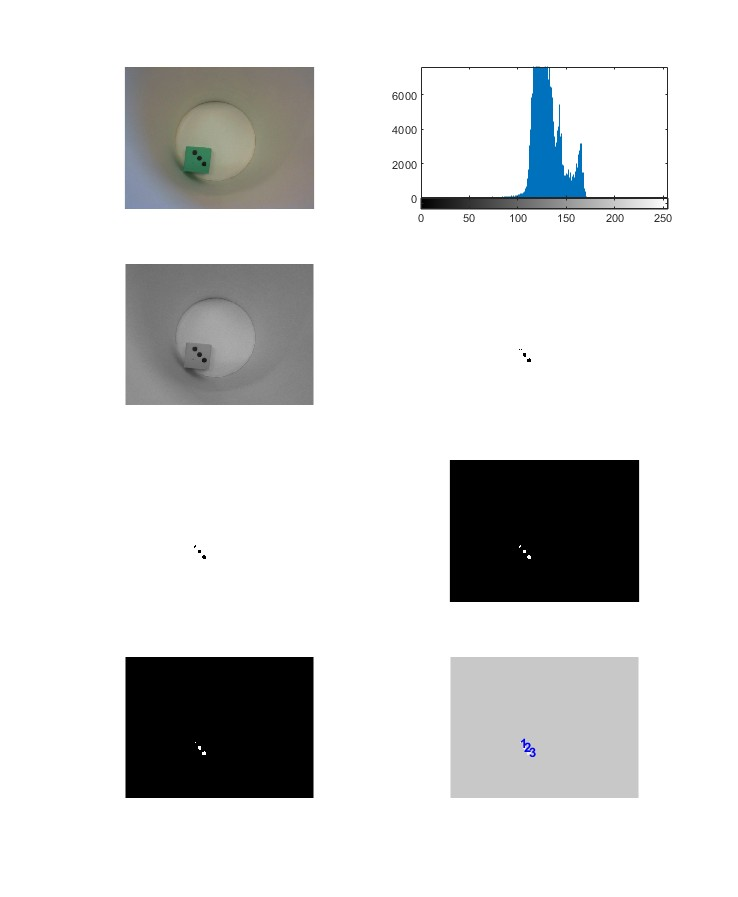

# Pervasive Computing Project: Snakes and Ladders

This project uses live image processing and speech recognition to enable players to play a digital version of the board game Snakes and Ladders. The project uses a camera to read the dots on a dice, and a learning model for speech recognition that uses the Fast Fourier Transform (FFT) coefficients to recognize specific words. All of the code was written in Matlab.

## Background

Snakes and Ladders is a classic board game that has been enjoyed by generations of players. In this game, players roll a dice and move their piece along a board, which is marked with a series of squares. The squares are numbered, and some of them are connected by snakes or ladders. When a player lands on a square that is connected to another square by a snake or ladder, they must move to that square.

In this project, we have developed a digital version of Snakes and Ladders that uses live image processing and speech recognition to enable players to interact with the game.

## Objectives

The objectives of this project are as follows:

- Develop a system for reading the dots on a dice using live image processing.
- Develop a system for interpreting the player's commands using speech recognition that uses the FFT coefficients to recognize specific words.
- Integrate the image processing and speech recognition systems to enable players to play a digital version of Snakes and Ladders.

## Technologies Used

The project uses the following technologies:

- Matlab: A programming language widely used in scientific computing and numerical analysis.
- Image Processing Toolbox: A toolbox for Matlab that provides tools for image processing and analysis.
- Fast Fourier Transform (FFT): A mathematical algorithm used to analyze signals and extract frequency information.
- Neural Network Toolbox: A toolbox for Matlab that provides tools for building and training neural networks.
- Audio Toolbox: A toolbox for Matlab that provides tools for working with audio data.

## Implementation

The project is implemented in the following steps:

1. **Dice Recognition:** We use the camera to capture an image of the dice. The image is then processed to extract the dot pattern on the dice. We use image processing techniques to enhance the image and extract the dot pattern.

2. **Speech Recognition:** We use the microphone to capture the player's commands. The audio data is then processed using the Audio Toolbox to extract the speech features. We then use a neural network that uses the FFT coefficients to recognize specific words.
3. **Game Play:** We integrate the image processing and speech recognition systems to enable players to play a digital version of Snakes and Ladders. The player rolls the dice using the camera, and the dot pattern is recognized using the FFT and neural network. The player's commands are recognized using the microphone and neural network, and the game board is updated accordingly.

## Conclusion

This project demonstrates the power of pervasive computing to create new and innovative user experiences. By combining live image processing, speech recognition, and machine learning techniques, we have created a digital version of Snakes and Ladders that is engaging and fun to play.

